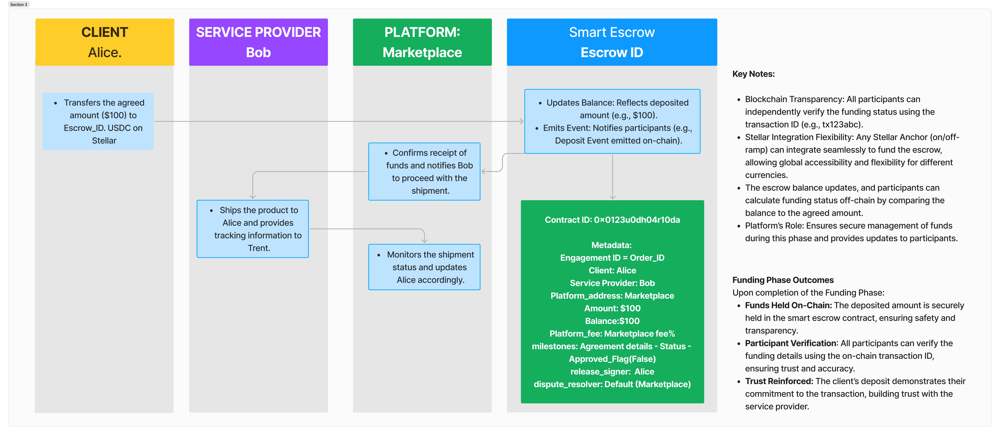

# Funding Phase

<figure><figcaption></figcaption></figure>

The Funding Phase is a critical step in the escrow process where the client deposits the agreed-upon funds into the escrow smart contract. This action ensures that the funds are securely held, builds trust among participants, and prepares the transaction for the next phases.

***

#### **Key Actions**

1. **Client Deposits Funds:**
   * The client (Alice) transfers the agreed amount (e.g., $100) to the escrow smart contract (Escrow ID) using USDC on Stellar.
2. **Escrow Contract Updates:**
   * The escrow contract:
     * Updates the balance to reflect the deposited amount (e.g., `$100`).
     * Emits a blockchain `Deposit Event`, notifying all participants of the successful funding.
3. **Verification by Participants:**
   * All participants, including the service provider (Bob) and platform (Marketplace), can independently verify the funding status using the transaction ID (e.g., `tx123abc`), ensuring transparency and security.

***

#### **Key Notes**

* **Blockchain Transparency:** All participants can independently verify the funding status using the transaction ID on-chain.
* **Stellar Integration Flexibility:** Any Stellar Anchor (on/off-ramp) can be seamlessly integrated to fund the escrow, allowing for global accessibility and currency flexibility.
* **Escrow Balance Updates:** Participants calculate funding status off-chain by comparing the balance with the agreed amount.
* **Platform's Role:** The platform ensures secure management of funds during this phase and provides updates to participants.

***

#### **Outcomes of the Funding Phase**

1. **Funds Held On-Chain:**
   * The deposited amount is securely held in the escrow smart contract, ensuring safety and transparency.
2. **Participant Verification:**
   * All participants can verify the funding details using the on-chain transaction ID, building trust and confidence.
3. **Trust Reinforced:**
   * The client’s deposit demonstrates their commitment to the transaction, fostering trust with the service provider.
