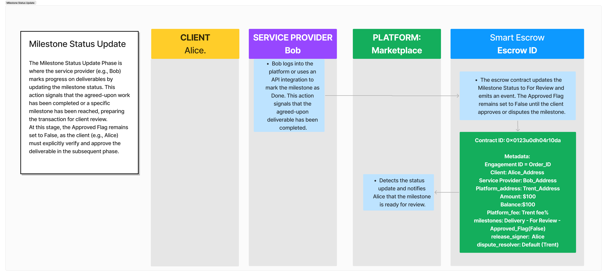

# Milestone Status Update

<figure><figcaption></figcaption></figure>

The Milestone Status Update Phase is where the service provider (e.g., Bob) marks progress on deliverables by updating the milestone status. This action signals that the agreed-upon work has been completed or a specific milestone has been reached, preparing the transaction for client review.

At this stage, the **Approved Flag** remains set to `False`, as the client (e.g., Alice) must explicitly verify and approve the deliverable in the subsequent phase.

***

#### **Key Actions**

1. **Service Provider Updates Milestone Status:**
   * The service provider (Bob) logs into the platform or uses the API to mark the milestone as **Done**, signaling the completion of the deliverable.
2. **Escrow Contract Updates:**
   * The escrow contract:
     * Updates the **Milestone Status** to **For Review**.
     * Emits an on-chain **Milestone Update Event**, notifying all participants of the milestone progress.
     * Keeps the **Approved Flag** set to `False` until further client action.
3. **Notification to Client:**
   * The platform detects the status update and notifies the client (Alice) that the milestone is ready for review.
4. **Transparency for All Participants:**
   * All participants, including the service provider (Bob), platform (Marketplace), and client (Alice), can view the updated milestone status on-chain, ensuring visibility into the transaction’s progress.

***

#### **Key Metadata**

1. **Milestone Status:**
   * **For Review:** Indicates the milestone is ready for client review or dispute.
2. **Approved Flag:**
   * **Default = False:** Remains unchanged until explicitly approved or disputed by the client.
3. **Updated Event:**
   * The escrow contract emits an event, notifying all participants of the milestone update.
4. **Progress Details:**
   * Optional fields can include:
     * Delivery notes.
     * Evidence of completion (e.g., reference IDs or uploaded documentation).

***

#### **Key Notes**

* **Blockchain Visibility:** All participants can view the updated milestone status on-chain, ensuring transparency and traceability of progress.
* **Platform Notifications:** The platform plays a key role in notifying the client (Alice) about the milestone update, facilitating smooth communication.
* **Optional Progress Details:** The service provider can add supporting details or documentation (e.g., delivery receipts, tracking numbers) to enhance transparency.

***

#### **Phase Outcomes**

1. **Milestone Progress Recorded:**
   * The service provider’s update is recorded on-chain, ensuring transparency and traceability.
2. **Client Notified for Review:**
   * The client (Alice) is notified to review the milestone and take action in the next phase.
3. **Escrow Contract Reflects Progress:**
   * The escrow contract’s milestone status is updated, preparing the transaction for the Approval Phase.
