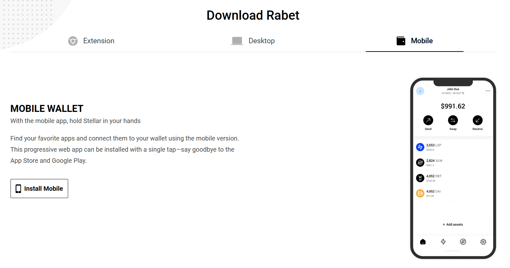
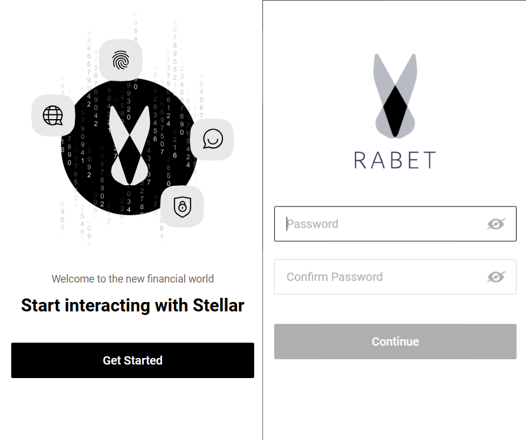

# Rabet Wallet

\
&#xNAN;_&#x4F;fficial logo of the Rabet Wallet._

Rabet Wallet is a browser extension and desktop wallet that simplifies Stellar account management and enables interactions with Stellar dApps.

***

## **What You’ll Learn**

* How to install and set up Rabet Wallet.
* How to connect Rabet Wallet to Trustless Work.
* Key resources and troubleshooting tips.

***

## **Installation and Setting Up Rabet Wallet**

## **1. Installing Rabet Wallet on Mobile**

### **Step-by-Step Instructions:**

1.  **Download the Rabet Mobile App:**

    * For **iOS Users**: Go to the [App Store](https://apps.apple.com/app/rabet-wallet).
    * For **Android Users**: Go to the [Google Play Store](https://play.google.com/store/apps/details?id=rabet.wallet).

     
2. **Install the App:**
   * Search for **"Rabet Wallet"** in your app store.
   * Tap the **"Install"** button and wait for the app to download.
3.  **Create a Wallet:**

    * Open the app and select **"Create Wallet"**.
    * Follow the instructions to generate a new wallet.
    * Securely save the **Seed Phrase** displayed during setup. This is critical for wallet recovery.

    

## **2. Installing Rabet Wallet on Desktop**

### **Step-by-Step Instructions**

1. **Download Rabet for Your Operating System:**
   * Visit the [Rabet Wallet website](https://rabet.io/).
   * Go to the **"Download"** section.
   * Select the version for your operating system:
     * **Windows:** Download the `.exe` file.
     * **macOS:** Download the `.dmg` file.
     * **Linux:** Download the `.AppImage` file.
2. **Install Rabet:**
   * **Windows:** Run the `.exe` file, follow the installation wizard, and launch Rabet.
   * **macOS:** Open the `.dmg` file and drag Rabet into the Applications folder.
   *   **Linux:** Make the `.AppImage` file executable by running:

       ```bash
       chmod +x rabet.AppImage
       ```

       Then execute the file:

       ```bash
       ./rabet.AppImage
       ```
3. **Create or Import Wallet:**
   * Launch the Rabet desktop application.
   * Choose **"Create Wallet"** to generate a new wallet or **"Import Wallet"** to restore an existing wallet using your Seed Phrase.
4. **Secure Your Wallet:**
   * Set a strong password to protect access to your wallet.


## **3. Installing Rabet Wallet as a Browser Extension**

### **Supported Browsers**

* **Google Chrome**
* **Brave**
* **Firefox**

### **Step-by-Step Instructions**

1. **Visit the Official Rabet Extension Page:**
   * For **Google Chrome and Brave:** Go to the [Chrome Web Store](https://chrome.google.com/webstore/detail/rabet-wallet).
   * For **Firefox:** Visit the [Firefox Add-ons page](https://addons.mozilla.org/en-US/firefox/addon/rabet-wallet/).
2. Click on **"Add to Browser"** for your preferred browser (e.g., Chrome, Brave, or Firefox).
   * Ensure you download only from the official website to avoid scams.
3. Follow the browser prompts to install the extension.
4. After installation, pin the Hana extension for easy access.

 

***

## **Connecting Rabet to Trustless Work**

1. Navigate to the Trustless Work platform.
   * Example link: [Trustless Work](https://dapp.trustlesswork.com/).
2. Click **"Connect Wallet"** in the top-right corner of the page.
3. Select **"Rabet Wallet"** from the list of options.
4. A pop-up will appear from Rabet asking for confirmation.
5. Approve the connection in the wallet extension.

 

***

## **Best Practices and Security Tips**

* **Backup Your Seed Phrase:** Store it in a secure, offline location.
* **Use Testnet for Development:** When testing or experimenting, always switch to the Testnet to avoid losing real funds.
* **Enable Browser Security Features:** Avoid installing unknown browser extensions that could compromise your wallet.

***

## **Useful Links and Resources**

* **Official Website:** [Rabet Wallet](https://rabet.io/)
* **Testnet Tokens:** [How to Get Testnet Tokens](../testnet-tokens.md)
* **Troubleshooting:** [Troubleshooting & FAQs](troubleshooting.md)

***

## **Frequently Asked Questions**

### **Q: What happens if I lose my recovery phrase?**

* Your recovery phrase is the only way to restore your wallet. If it’s lost, your funds cannot be recovered.

### **Q: How do I switch between Testnet and Mainnet?**

1. Open the Rabet extension.
2. Click on the settings icon.
3. Toggle between Testnet and Mainnet in the dropdown.
