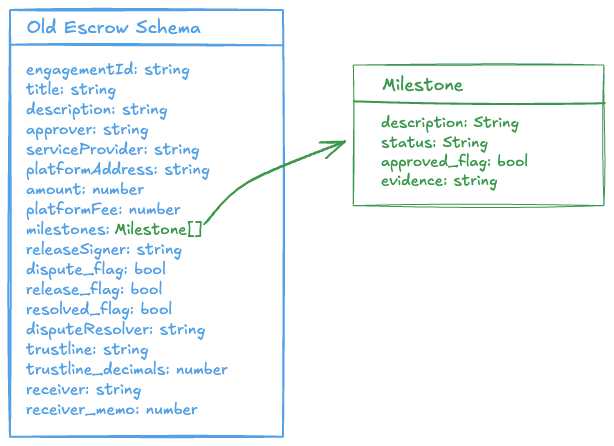

# Escrow Lifecycle

The escrow lifecycle represents the structured flow of actions and responsibilities involved in securely managing a transaction. At Trustless Work, we break this lifecycle into clear, logical phases, ensuring transparency and adaptability for diverse use cases.

<figure><figcaption></figcaption></figure>

### **Core Phases of the Escrow Lifecycle**

1. **Initiation Phase:**\
   The foundation of the process, where roles, responsibilities, and transaction terms are established, and the escrow contract is created. [Learn More](initiation-phase.md)
2. **Funding Phase:**\
   The phase where the funds are deposited into the escrow contract, securing the transaction and preparing for the next steps.
3. **Milestone Updates Phase:**\
   As the transaction progresses, milestones are marked as completed by the designated party, providing visibility and enabling reviews.
4. **Approval Phase:**\
   The phase where milestones are reviewed and approved (or disputed), moving the transaction closer to resolution.
5. **Release Phase:**\
   Funds are released to the designated recipient based on milestone approvals or dispute resolutions, completing the financial component of the transaction.

***

### **Alternative Phase in the Escrow Lifecycle**

If, any of the parties raise a dispute, the lifecycle takes a " detour" into the dispute resolution phase.

1. **Dispute Resolution Phase:**\
   Engaged when there are disagreements between parties, this phase ensures fairness by resolving disputes and determining the final outcome. Disputes can end in a full refund, partial refund, or null refund to the client.&#x20;
