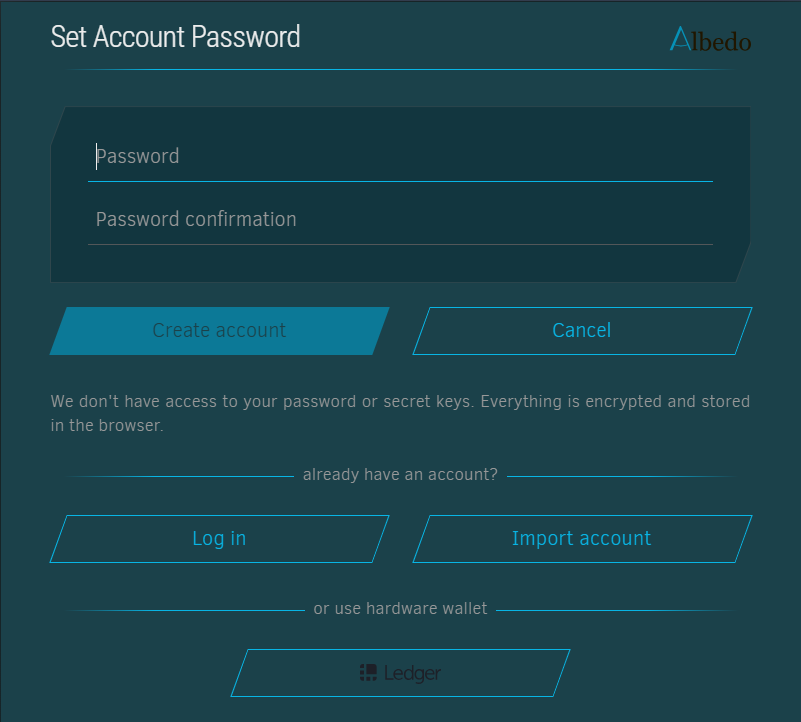

# Albedo Wallet

\
&#xNAN;_&#x4F;fficial logo of the Albedo Wallet._

Albedo is a web-based wallet for Stellar, offering simple and secure ways to sign Stellar transactions.

***

## **What You’ll Learn**

* How to install and set up Albedo Wallet.
* How to connect Albedo Wallet to Trustless Work.
* Useful resources and FAQs.

***

## **Installation and Setting Up Your Wallet**

### **Step-by-Step Instructions:**

1. Visit [Albedo Wallet](https://albedo.link/).
2. Click **"Create Albedo Account"** and follow the prompts.
3. Save your backup key securely.
4. Verify your account and log in.

 

### **Importing an Existing Account**

1. Open Albedo Wallet.
2. Click on **"Create Albedo Account"** and follow the prompts.
3. Click on **"Import Account"**.
4. Enter your existing Seed Phrase and set a password.

***

## **Connecting Albedo to Trustless Work**

1. Navigate to the Trustless Work platform.
   * Example link: [Trustless Work](https://dapp.trustlesswork.com/).
2. Click **"Connect Wallet"** in the top-right corner of the page.
3. Select **"Albedo Wallet"** from the list of options.
4. Authorize the connection on Albedo's interface.

 

***

## **Best Practices and Security Tips**

* **Backup Your Seed Phrase:** Store it in a secure, offline location.
* **Use Testnet for Development:** When testing or experimenting, always switch to the Testnet to avoid losing real funds.
* **Enable Browser Security Features:** Avoid installing unknown browser extensions that could compromise your wallet.

***

## **Useful Links and Resources**

* **Official Website:** [Albedo](https://albedo.link/)
* **Documentation:** [Albedo Documentation](https://albedo.link/docs)
* **Testnet Tokens:** [How to Get Testnet Tokens](../testnet-tokens.md)
* **Troubleshooting:** [Troubleshooting & FAQs](../troubleshooting.md)

***

## **6. Frequently Asked Questions**

### **Q: What happens if I lose my recovery phrase?**

* Your recovery phrase is the only way to restore your wallet. If it’s lost, your funds cannot be recovered.
