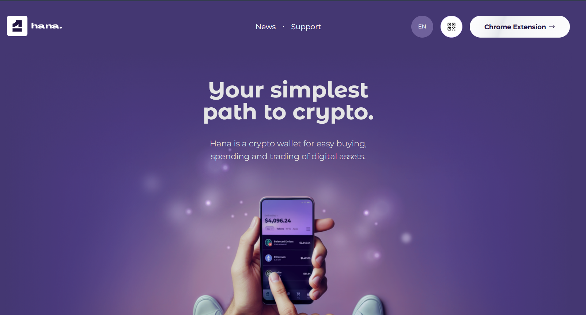

# Hana Wallet Guide

  
*Official logo of the Hana Wallet.*

Hana Wallet is a lightweight browser extension wallet for Stellar, offering an easy and secure way to manage accounts and sign transactions.

---

## **What You’ll Learn**
- How to install and set up Hana Wallet.
- How to connect Hana Wallet to Trustless Work.
- Key resources and troubleshooting.

---

## **Installation**

### **Step-by-Step Instructions:**
1. Visit the official [Hana Wallet website](https://www.hanawallet.io/).
2. Download and install the browser extension for your preferred browser (Chrome or Brave).
3. Pin the Hana extension for quick access.

---

## **Setting Up Hana Wallet**

### **Creating a New Wallet**
1. Open the Hana extension by clicking on its icon in your browser.
2. Click on **"Create Wallet"**.
3. Set a secure password (store this password securely).
4. Hana will generate a **Recovery Phrase** (also called a Seed Phrase).
   - Write it down and store it in a safe place. **Do not share it with anyone**.

### **Importing an Existing Wallet**
1. Open the Hana extension.
2. Click on **"Import Wallet"**.
3. Enter your existing Seed Phrase and set a password.

---

## **Connecting Hana Wallet to Trustless Work**

1. Navigate to the Trustless Work platform.
   - Example link: [Trustless Work](https://dapp.trustlesswork.com/).
2. Click **"Connect Wallet"** in the top-right corner of the page.
3. Select **"Hana Wallet"** from the list of options.
4. A pop-up will appear from Hana asking for confirmation.
5. Approve the connection in the wallet extension.  

  

### **Note:** 
- Ensure Hana is set to the correct network (Testnet or Mainnet) based on your environment. You can toggle the network in the Hana settings.

---

## **Best Practices and Security Tips**

- **Backup Your Seed Phrase:** Store it in a secure, offline location.
- **Use Testnet for Development:** When testing or experimenting, always switch to the Testnet to avoid losing real funds.
- **Enable Browser Security Features:** Avoid installing unknown browser extensions that could compromise your wallet.

---

## **Useful Links and Resources**
- **Hana Official Website:** [Hana Wallet](https://www.hanawallet.io/)
- **FAQs and Support:** [Hana Support](https://support.hanawallet.io/en/)
- **Testnet Tokens:** [How to Get Testnet Tokens](../testnet-tokens.md)
- **Troubleshooting:** [Troubleshooting & FAQs](../troubleshooting.md)

---

## **Frequently Asked Questions**

### **Q: What happens if I lose my recovery phrase?**
- Your recovery phrase is the only way to restore your wallet. If it’s lost, your funds cannot be recovered.

### **Q: How do I switch between Testnet and Mainnet?**
1. Open the Hana extension.
2. Click on the settings icon.
3. Toggle between Testnet and Mainnet in the dropdown.
