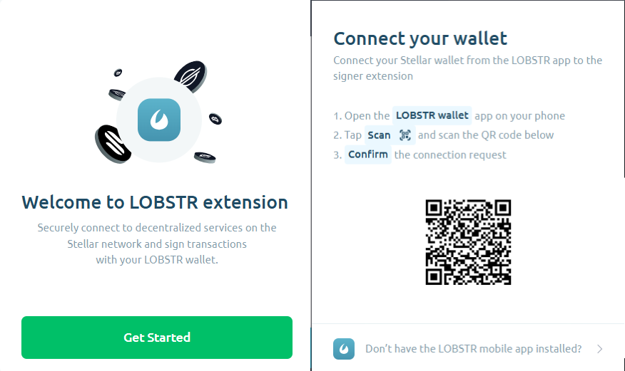

# Lobstr Wallet

\
&#xNAN;_&#x4F;fficial logo of the Lobstr Wallet._

Lobstr Wallet is a user-friendly mobile and web wallet for managing Stellar accounts. It supports advanced features like multisignature accounts and Stellar-powered services.

***

## **What You’ll Learn**

* How to install and set up Lobstr Wallet.
* How to connect Lobstr Wallet to Trustless Work.
* Key resources, tips, and support.

***

## **Installation**

### **Step-by-Step Instructions:**

### **Mobile Wallet Setup:**

1. Download the **Lobstr Wallet app** from the [App Store](https://apps.apple.com) or [Google Play Store](https://play.google.com).
2. Open the app and follow the instructions to create a new wallet.
3. Save your **Recovery Phrase** securely.
4. Set a PIN or biometric authentication for added security.

### **Web Wallet Setup:**

1. Visit the [Lobstr Wallet website](https://lobstr.co/).
2. Sign up for an account or log in if you already have one.
3. Follow the prompts to secure your wallet.

***

## **Connecting Lobstr to Trustless Work**

1. Navigate to the Trustless Work platform.
   * Example link: [Trustless Work](https://dapp.trustlesswork.com/).
2. Click **"Connect Wallet"** in the top-right corner of the page.
3. Select **"Lobstr Wallet"** from the list of options.
4. A pop-up will appear from Lobstr asking for confirmation.
5. Approve the connection in the wallet extension.

 

***

## **Best Practices and Security Tips**

* **Backup Your Seed Phrase:** Store it in a secure, offline location.
* **Use Testnet for Development:** When testing or experimenting, always switch to the Testnet to avoid losing real funds.
* **Enable Browser Security Features:** Avoid installing unknown browser extensions that could compromise your wallet.

***

## **Useful Links and Resources**

* **Lobstr Official Website:** [Lobstr Wallet](https://lobstr.co/)
* **Lobstr Mobile Apps:** [iOS](https://apps.apple.com) | [Android](https://play.google.com)
* **Testnet Tokens:** [How to Get Testnet Tokens](../../../using-the-dapp/testnet-tokens.md)
* **Troubleshooting:** [Troubleshooting & FAQs](../troubleshooting.md)
* **FAQs and Support:** [Lobstr FAQ](https://lobstr.co/faq)

***

## **Frequently Asked Questions**

### **Q: What happens if I lose my recovery phrase?**

* Your recovery phrase is the only way to restore your wallet. If it’s lost, your funds cannot be recovered.
