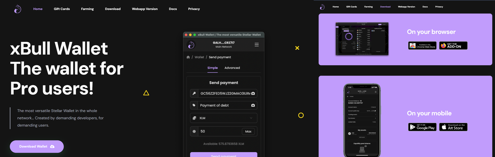

# xBull Wallet

\
&#xNAN;_&#x4F;fficial logo of the xBull Wallet._

xBull Wallet is a secure and fast web-based wallet designed for Stellar users. It provides a seamless experience for managing Stellar accounts and interacting with Stellar dApps.

***

## **What You’ll Learn**

* How to install and set up xBull Wallet.
* How to connect xBull Wallet to Trustless Work.
* Useful resources, tips, and troubleshooting.

***

## **Installation**

### **Step-by-Step Instructions:**

1. Visit the official [xBull Wallet](https://xbull.app) website.
2. Click **"Download Wallet"** and then install for your preferred browser (e.g., Chrome, Brave, or Firefox).
   * Ensure you download only from the official website to avoid scams.
3. After installation, pin the xBull extension for easy access.

***

## **Setting Up xBull Wallet**

### **Creating a New Wallet**

1. Open the xBull extension by clicking on its icon in your browser.
2. Click on **"Generate Wallet"**.
3. Set a secure password (store this password securely).
4. xBull will generate a **Recovery Phrase** (also called a Seed Phrase).
   * Write it down and store it in a safe place. **Do not share it with anyone**.

### **Importing an Existing Wallet**

1. Open the xBull extension.
2. Click on **"Import Wallet"**.
3. Enter your existing Seed Phrase and set a password.

***

## **Connecting xBull Wallet to Trustless Work**

1. Navigate to the Trustless Work platform.
   * Example link: [Trustless Work](https://dapp.trustlesswork.com/).
2. Click **"Connect Wallet"** in the top-right corner of the page.
3. Select **"xBull Wallet"** from the list of options.
4. A pop-up will appear from xBull asking for confirmation.
5. Approve the connection in the wallet extension.

 

### **Note:**

* Ensure xBull is set to the correct network (Testnet or Mainnet) based on your environment. You can toggle the network in the xBull settings.

***

## **Best Practices and Security Tips**

* **Backup Your Seed Phrase:** Store it in a secure, offline location.
* **Use Testnet for Development:** When testing or experimenting, always switch to the Testnet to avoid losing real funds.
* **Enable Browser Security Features:** Avoid installing unknown browser extensions that could compromise your wallet.

***

## **Useful Links and Resources**

* **xBull Official Website:** [xBull Wallet](https://xbull.app)
* **xBull Documentation:** [xBull Docs](https://xbull.app/docs/)
* **Testnet Tokens:** [How to Get Testnet Tokens](../testnet-tokens.md)
* **Troubleshooting:** [Troubleshooting & FAQs](../troubleshooting.md)

***

## **Frequently Asked Questions**

### **Q: What happens if I lose my recovery phrase?**

* Your recovery phrase is the only way to restore your wallet. If it’s lost, your funds cannot be recovered.

### **Q: How do I switch between Testnet and Mainnet?**

1. Open the xBull extension.
2. Click on the settings icon.
3. Toggle between Testnet and Mainnet in the dropdown.
