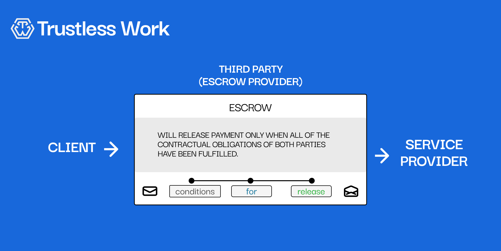

# 🔍 What are Escrows

**Escrows** are a critical financial tool that ensures **security, trust, and transparency** in transactions. Traditionally, escrows involve a **neutral third party** that holds funds until specific conditions are met, protecting both buyers and sellers.

In an age of increasing digitization and decentralized systems, escrows are evolving—moving from being dependent on centralized authorities like banks to **blockchain-powered smart contracts**. But how exactly do escrows work? Why are they so effective, and why is **blockchain the next frontier** for escrows?

Let’s dive in. 🚀

<figure><figcaption>
The image above shows a <strong>traditional escrow setup</strong>, where a third party (the escrow provider) manages funds between a <strong>client</strong> and a <strong>service provider</strong>. Payment is only released when the contractual obligations have been fulfilled.
</figcaption></figure>

***

### **Why Escrows Matter Today**

Escrows are more relevant today than ever, especially with the rise of the digital economy and the increasing need for secure transactions. Escrows are used across a variety of industries, each requiring different levels of **trust and transparency**. Here are some common use cases:

#### **1. E-Commerce 🛒**

* Platforms like **eBay** and **Amazon Marketplace** utilize escrows to ensure that buyers get the products they ordered and sellers receive payment only when all conditions are met.

#### **2. Freelancing & Contract Work 💼**

* **Upwork** and **Fiverr** use escrows to hold funds securely during projects, ensuring freelancers are paid for their work and clients are assured of delivery before funds are released.

#### **3. Domain Name Sales 🌐**

* Buying and selling domain names involves significant sums of money, and escrows are crucial to ensure both buyer and seller meet their obligations.
* Services like **Escrow.com** specialize in providing safe transactions for domain sales, holding the payment until the domain is successfully transferred.

#### **4. Real Estate 🏠**

* Escrow accounts are an integral part of real estate transactions, where **banks** or **escrow agents** hold funds until all contractual obligations are met (e.g., inspections, legal paperwork).
* Escrows minimize risk in property deals by ensuring the buyer gets what they pay for and the seller gets their funds securely.

#### **5. Mergers & Acquisitions 🤝**

* During company acquisitions, escrow accounts hold a portion of the funds to cover any future liabilities or to ensure that specific conditions are met before the sale is fully executed.

#### **6. Crowdfunding & Investments 📊**

* Escrow is used to hold investments or funds raised until certain project milestones are reached. This is common in startup funding rounds or community-backed crowdfunding projects.

#### **7. Car Rentals & Security Deposits 🚗**

* Escrow accounts are being used in **car rentals** to securely hold security deposits, which are only released once the car is returned without damage or extra charges.

<figure><figcaption>
In the traditional model, funds are often held by <strong>banks</strong> or <strong>lawyers</strong> during transactions like real estate purchases, ensuring all parties meet their obligations before money changes hands.
</figcaption></figure>

### **Learn More About Escrows**

Escrows play an essential role across a variety of industries. Now, blockchain technology is pushing escrows into a new era—making them **trustless**, efficient, and accessible.

#### **Dive Deeper into Escrows:**

* **📜** [**Escrow History**](escrow-history/): Discover the roots of escrows, from their origins in property sales to their modern use in the digital economy.
* **🔒** [**Why Blockchain Escrow?**](blockchain-era-smart-escrows.md): Understand how blockchain is transforming the escrow process and why it’s the future of secure transactions.

Click below to explore the next chapters and learn why blockchain-based escrows are a game-changer!

