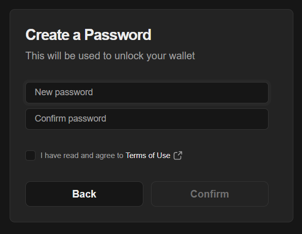
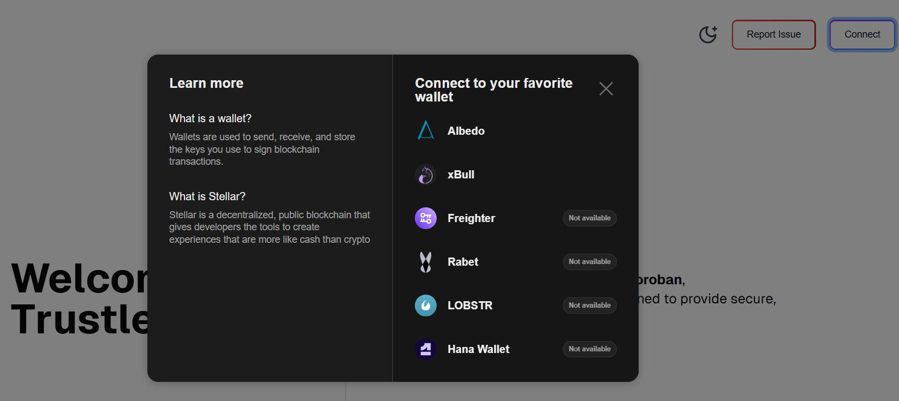

# Freighter Wallet

\
\&#xNAN;_Official logo of the Freighter Wallet._

Freighter is a browser extension wallet for Stellar. It is a non-custodial wallet extension for your browser.

***

## **What You’ll Learn**

* How to install and set up Freighter Wallet.
* How to connect Freighter Wallet to Trustless Work.
* Useful resources, security tips, and FAQs.

***

## **Installation**

### **Step-by-Step Instructions:**

1. Open the official [Freighter Wallet website](https://www.freighter.app/).
2. Click on **"Add to Browser"** for your preferred browser (e.g., Chrome, Brave, or Firefox).
   * Ensure you download only from the official website to avoid scams.
3. Follow the browser prompts to install the extension.
4. After installation, pin the Freighter extension for easy access.

***

## **Setting Up Freighter Wallet**

### **Creating a New Wallet**

1. Open the Freighter extension by clicking on its icon in your browser.
2. Click on **"Create New Wallet"**.
3. Set a secure password (store this password securely).
4. Freighter will generate a **Recovery Phrase** (also called a Seed Phrase).
   * Write it down and store it in a safe place. **Do not share it with anyone**.

 

### Fund your Testnet account

You need a funded Testnet account to submit transactions and pay fees.

1. Open the Freighter extension.
2. Switch the network to **Testnet**.

<figure><figcaption></figcaption></figure>

3. Click **Fund with Friendbot**.

<figure><figcaption></figcaption></figure>

4. Wait for the balance to appear.
5. Your account is now active on Stellar Testnet.


Friendbot only works on **Testnet**. If you don’t see the button, verify the network first.


Friendbot fallback (manual)

If the in-wallet Friendbot flow fails, you can request funds directly:

1. Copy your account address (your public key) from Freighter.
2. Open: `https://friendbot.stellar.org/?addr=YOUR_PUBLIC_KEY`
3. Replace `YOUR_PUBLIC_KEY` with your address and load the URL.

### **Importing an Existing Wallet**

1. Open the Freighter extension.
2. Click on **"Import Wallet"**.
3. Enter your existing Seed Phrase and set a password.

***

## **Connecting Freighter to Trustless Work**

1. Navigate to the Trustless Work platform.
   * Example link: [Trustless Work](https://dapp.trustlesswork.com/).
2. Click **"Connect Wallet"** in the top-right corner of the page.
3. Select **"Freighter Wallet"** from the list of options.
4. A pop-up will appear from Freighter asking for confirmation.
5. Approve the connection in the wallet extension.

 

### **Note:**

* Ensure Freighter is set to the correct network (Testnet or Mainnet) based on your environment. You can toggle the network in the Freighter settings.

***

## **Best Practices and Security Tips**

* **Backup Your Seed Phrase:** Store it in a secure, offline location.
* **Use Testnet for Development:** When testing or experimenting, always switch to the Testnet to avoid losing real funds.
* **Enable Browser Security Features:** Avoid installing unknown browser extensions that could compromise your wallet.

***

## **Useful Links and Resources**

* **Official Website:** [Freighter Wallet](https://www.freighter.app/)
* **Documentation:** [Freighter GitHub Repo](https://github.com/stellar/freighter)
* **Testnet Tokens:** [How to Get Testnet Tokens](../testnet-tokens.md)
* **Troubleshooting:** [Troubleshooting & FAQs](../../../support/troubleshooting.md)

***

## **Frequently Asked Questions**

### **Q: What happens if I lose my recovery phrase?**

* Your recovery phrase is the only way to restore your wallet. If it’s lost, your funds cannot be recovered.

### **Q: How do I switch between Testnet and Mainnet?**

1. Open the Freighter extension.
2. Click on the settings icon.
3. Toggle between Testnet and Mainnet in the dropdown.
