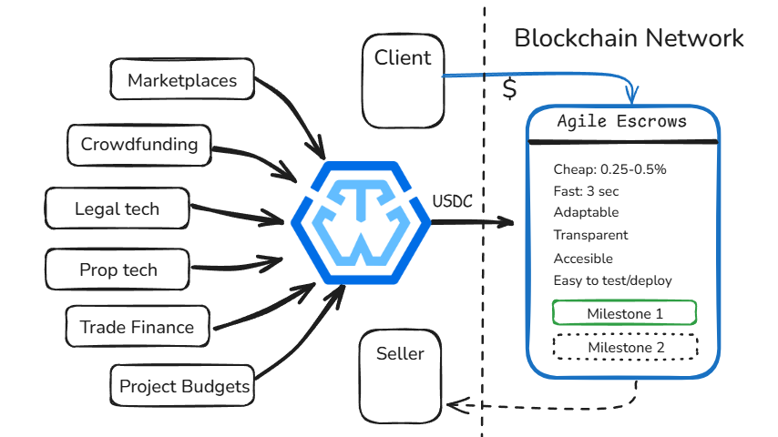

# Education & Online Courses

Online education platforms and independent educators often face challenges related to payment security, trust, and accountability. Learners worry about course quality and delivery, while educators face risks of non-payment, disputes, and complex refund processes. Existing solutions are centralized, costly, and can introduce delays or disputes.

**Solution**

Trustless Work provides a decentralized, transparent escrow solution to streamline transactions between learners and educators. By leveraging blockchain technology, it ensures secure, timely payments tied to course milestones and learner satisfaction, significantly reducing fraud and disputes.

**How It Works**

<figure><figcaption></figcaption></figure>

1. **Course Enrollment (Initiation & Funding Phase):**
   * Learners enroll in a course and deposit payment into a Trustless Work escrow.
   * Funds are securely held in a neutral escrow smart contract.
2. **Milestone Completion (Milestone Update Phase):**
   * Educators deliver course content in predefined milestones (modules, live sessions, assessments).
   * Milestones are marked as complete by the educator and trigger notifications to learners.
3. **Learner Approval (Approval Phase):**
   * Learners review completed milestones and approve content delivery.
   * If satisfied, learners sign off on milestone approval through a simple UI.
   * If dissatisfied, learners can raise disputes directly through the platform.
4. **Funds Release:**
   * Upon approval, funds corresponding to completed milestones are automatically released to educators.
   * If disputed, funds remain locked until resolution through either manual arbitration or platform-defined rules.

**Benefits**

* **Security & Trust:** Funds are held transparently in escrow, reassuring learners and guaranteeing payment to educators upon satisfactory delivery.
* **Transparency:** Every step, from enrollment to milestone completion and payment, is clearly logged and visible.
* **Reduced Disputes:** Clear milestones and approvals decrease misunderstandings and simplify dispute resolution.
* **Cost Efficiency:** Low transaction costs and automated escrow release lower overhead for education platforms and independent educators.

**Potential Use Cases**

* Independent online educators offering premium courses
* Bootcamps or cohort-based education programs
* Certification programs requiring demonstrable course completion
* Learning marketplaces where trust and accountability are essential

By integrating Trustless Work's escrow solution, education providers can offer safer, more transparent transactions, creating confidence and enabling smoother learner-educator interactions.
