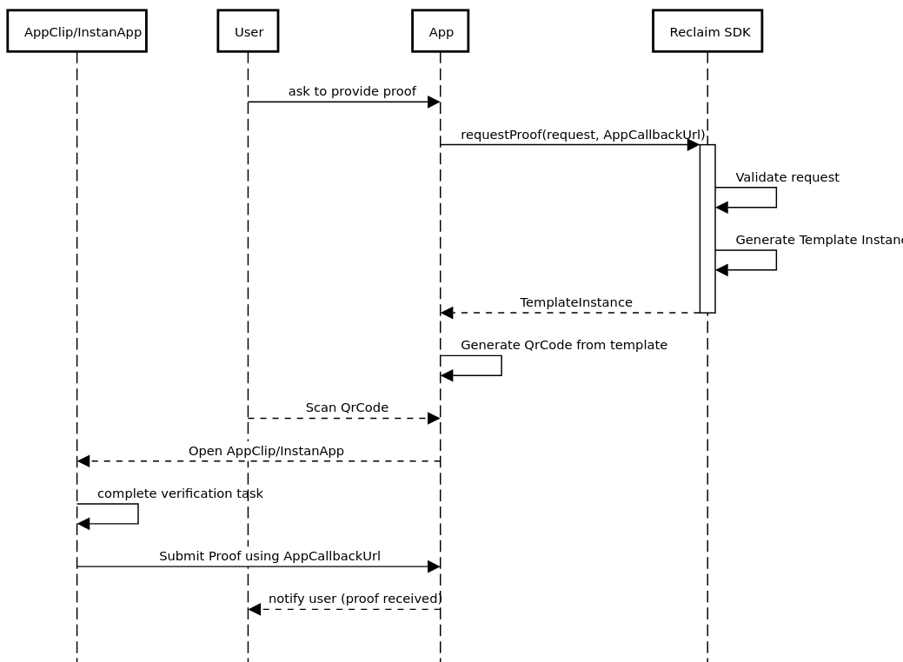
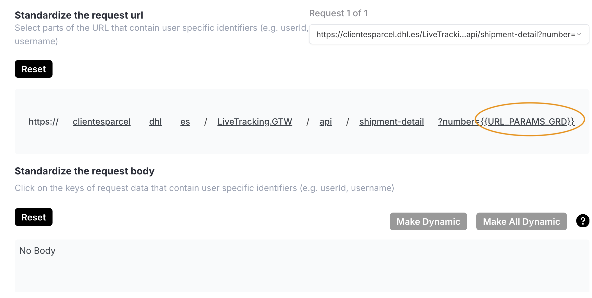
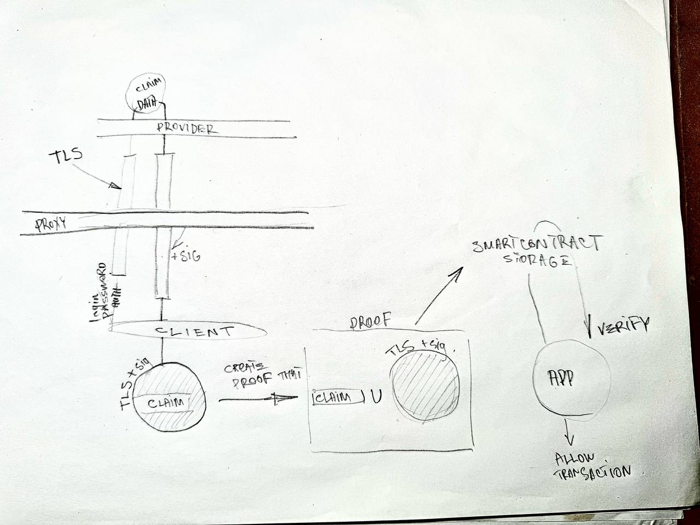

The goal of this Spike is to explore how Reclaim Protocol can be integrated into Trustless Work's escrow system to enable attestations of off-chain actions.


# SPIKE 
there are two mean flow: UI and zkfetch.
with zkfetch it's possible to make proofs without frontend (see below)

## UI flow:

to build [and run example](./setup.md)

### How are proofs requested from users?

<p align="center">  </p>

user MUST scan QR code on frontend app and install mobile Reclaim app, using which all proxy magic happens,
i.e creates claim, auth, extracting TLS blocks and creating something like zk proof.

(probably there is way to build own flow with their core https://github.com/reclaimprotocol/attestor-core
but it's task for another spike)

### How is proof data structured for on-chain submission? 

this example claims github username, 
and we get following proof on frontend: 
```json 
{
    "identifier": "0x46d4e5f8383837b1a9f40ce1605292862e00db8156e8e3cb50f2d30ab3614038",
    "claimData": {
        "provider": "http",
        "parameters": "{\"additionalClientOptions\":{},\"body\":\"\",\"geoLocation\":\"\",\"headers\":{\"Sec-Fetch-Mode\":\"same-origin\",\"Sec-Fetch-Site\":\"same-origin\",\"User-Agent\":\"Mozilla/5.0 (Linux; Android 15) AppleWebKit/537.36 (KHTML, like Gecko) Chrome/129.0.6668.69 Mobile Safari/537.36\"},\"method\":\"GET\",\"paramValues\":{\"username\":\"beeguy74\"},\"responseMatches\":[{\"invert\":false,\"type\":\"contains\",\"value\":\"<span class=\\\"color-fg-muted\\\">({{username}})</span>\"}],\"responseRedactions\":[{\"jsonPath\":\"\",\"regex\":\"<span class=\\\"color-fg-muted\\\">\\\\((.*)\\\\)</span>\",\"xPath\":\"\"}],\"url\":\"https://github.com/settings/profile\"}",
        "owner": "0x92d2cc19674ac363dc0fcf63cc91bbe55a6abcfe",
        "timestampS": 1741893395,
        "context": "{\"contextAddress\":\"user's address\",\"contextMessage\":\"for acmecorp.com on 1st january\",\"extractedParameters\":{\"username\":\"beeguy74\"},\"providerHash\":\"0xcb4a6b54d59f97b5891cced83e9e909c938bc06149a22f9e76309f2d20300609\"}",
        "identifier": "0x46d4e5f8383837b1a9f40ce1605292862e00db8156e8e3cb50f2d30ab3614038",
        "epoch": 1
    },
    "signatures": [
        "e96ff3996d164ff135742ee2fbd8e8385ababdabbcedb52d079a8b5c157be80118004652361249fcc2f58ad8ec2c5e7aab0cd25892d2e14838f1ee94b9d52d98"
    ],
    "witnesses": [
        {
            "id": "0x244897572368eadf65bfbc5aec98d8e5443a9072",
            "url": "wss://attestor.reclaimprotocol.org/ws"
        }
    ],
    "publicData": null
}
```

which transforms for on chain:
```json
{
    "claimInfo": {
        "context": "{\"contextAddress\":\"user's address\",\"contextMessage\":\"for acmecorp.com on 1st january\",\"extractedParameters\":{\"username\":\"beeguy74\"},\"providerHash\":\"0xcb4a6b54d59f97b5891cced83e9e909c938bc06149a22f9e76309f2d20300609\"}",
        "parameters": "{\"additionalClientOptions\":{},\"body\":\"\",\"geoLocation\":\"\",\"headers\":{\"Sec-Fetch-Mode\":\"same-origin\",\"Sec-Fetch-Site\":\"same-origin\",\"User-Agent\":\"Mozilla/5.0 (Linux; Android 15) AppleWebKit/537.36 (KHTML, like Gecko) Chrome/129.0.6668.69 Mobile Safari/537.36\"},\"method\":\"GET\",\"paramValues\":{\"username\":\"beeguy74\"},\"responseMatches\":[{\"invert\":false,\"type\":\"contains\",\"value\":\"<span class=\\\"color-fg-muted\\\">({{username}})</span>\"}],\"responseRedactions\":[{\"jsonPath\":\"\",\"regex\":\"<span class=\\\"color-fg-muted\\\">\\\\((.*)\\\\)</span>\",\"xPath\":\"\"}],\"url\":\"https://github.com/settings/profile\"}",
        "provider": "http"
    },
    "signedClaim": {
        "claim": {
            "epoch": 1,
            "identifier": "0x46d4e5f8383837b1a9f40ce1605292862e00db8156e8e3cb50f2d30ab3614038",
            "owner": "0x92d2cc19674ac363dc0fcf63cc91bbe55a6abcfe",
            "timestampS": 1741893395
        },
        "signatures": [
            "0xe96ff3996d164ff135742ee2fbd8e8385ababdabbcedb52d079a8b5c157be80118004652361249fcc2f58ad8ec2c5e7aab0cd25892d2e14838f1ee94b9d52d981c"
        ]
    }
}
```

but it's up to us how to store proof (except `signedClaim` part which used in validating the proof): 
so `parameters` contain info we want to check before validating proof, like username or whatever
and in some cases we should not store it publicly (eg. last transaction of the bank account)

`context` field is fully custom

### How is a proof validated in a smart contract?
actually it's not requiered to validate it on chain, you can find this in zkfetch example (sig verified off-chain)
we take only `signedClaim` part of proof.
and send to smart contract: 

* `signedClaim` -> prefix + serialize -> hash -> message_digest
* signature
* recovery id, the last byte in ECDSA signature. It is either 0 or 1

we check on chain that signature made by some trusted address in particular epoch (withness)

```rust
pub struct Witness {
    pub address: BytesN<20>,  // Ethereum-style 20-byte address derived from the public key
    pub host: String,         // Host/domain associated with the witness (e.g., "http")
}
```
These witnesses are usually off-chain servers or validators maintained by the Reclaim protocol.
The Reclaim protocol frontend SDK (@reclaimprotocol/js-sdk) fetches this list along with the proof data, once verification is complete.

1. message_digest + signature + recovery_id
2. recover public key (secp256k1): call `secp256k1_recover()` to obtain the public key (full address) from provided signature data and recovery ID. elliptic curve magic. pub key is (65 bytes)
3. hash public key (keccak256): (Ethereum-style) Removes prefix byte, hashes the remaining 64 bytes (keccak256),
4. take last 20 bytes -> address (takes the last 20 bytes of this hash to form the Ethereum-style address (BytesN<20>)
5. check addr against epoch witness addresses in epoch 
6. VALID or INVALID

it's NOT validation of zk-proof but basic validation of signature.
So that it require to trust witness (attestor)

Proofs (signatures) themselves are not stored on-chain. 
They are typically stored off-chain and only validated on-chain upon request.
But it's up to whoever implement this.

## zkFetch flow:

the only difference that we can fetch data without frontend and should create proof with zk circuit in place.
but in case of private data with auth we need to obtain token or credentials somehow.

here is all possible options to show potential usage 
```javascript

  const publicOptions = {
    method: 'GET', // or POST
    headers : {
      accept: 'application/json, text/plain, */*' 
    }, 
    geoLocation: "",
    body: "",
  }
 
  const privateOptions = {
    headers {
        apiKey: "123...456",
        someOtherHeader: "someOtherValue",
    },
    cookieStr: "", 
    paramValues: {},
    responseMatches: [{ type: 'regex', value: '(?<data>.*)' }],
    responseRedactions: [{'regex': '(?<data>.*)'}]
  }
 
  const proof = await client.zkFetch(
    'https://your.url.org',
    publicOptions,
    privateOptions
  )
```

the rest steps like validation of signature is the same as UI flow

### What modifications are needed to store & verify attestations?

In order to verify proof it takes to create logic for each provider (`PROVIDER_ID`) like github or google. 

There is signature and context in proof which we get from reclaim. 
For example, we get some proof of github username claim. 
We should get username from user via frontend form or from escrow itself(when freelancer should commit something on github and it's written into the escrow.)
And then we should match this username with what we have in `parameters` object in reclaim proof
```json
{
  "additionalClientOptions": {},
  "body": "",
  "geoLocation": "",
  "headers": {
    "Sec-Fetch-Mode": "same-origin",
    "Sec-Fetch-Site": "same-origin",
    "User-Agent": "Mozilla/5.0 (Linux; Android 15) AppleWebKit/537.36 (KHTML, like Gecko) Chrome/129.0.6668.69 Mobile Safari/537.36"
  },
  "method": "GET",
  "paramValues": {
    "username": "Bob"  <--------- what we look for
  },
  "responseMatches": [
    {
      "invert": false,
      "type": "contains",
      "value": "<span class=\"color-fg-muted\">({{username}})</span>"
    }
  ],
  "responseRedactions": [
    {
      "jsonPath": "",
      "regex": "<span class=\"color-fg-muted\">\\((.*)\\)</span>",
      "xPath": ""
    }
  ],
  "url": "https://github.com/settings/profile"
}
```


in case of payments we should match destination with what we have in `parameters`
so that it's additional parser and logic to handle what we want to check for each provider.

On frontend side should be different UI when escrow has some provider and Step 5: Marking a Milestone as Done
should provide QR code to user and process claim

On chain we just verify signature and if it's valid approve milestone and store the proof

### Can we attach attestations to milestones?
yes, each attestation has it's id so for example: 

```
{
    signer: "GAD4T6Z63N5NJLQYY3J5MVYFHH5I5UB7NDUUYZD7HHB3RMS6X3H4YK7P",
    engagementId: "ENG12345",
    title: "Project Title",
    description: "This is a detailed description of the project.",
    approver: "GAHJZHVKFLATA7RVGXSFKXAKT5H4RXJ4LU2UR2W2IDFXOJQ2BR7RHW62",
    serviceProvider: "GDWPCWWH7IXQJHDF7FJUI7VOGD5IT72T7YX55F4BR2H4WXFRBVMBK6A3",
    platformAddress: "GBC5DVYUBTBSXJ3ZMRPGXDDDLKTALIFGRW73B33AF5EFSZBUECKSFO4R",
    amount: "1000.00",
    platformFee: "50.00",
    milestones: [
        { description: "Initial phase of the project", status: "Pending", approved_flag: false },
        { description: "Completion of design work", status: "Pending", approved_flag: false }
    ],
    releaseSigner: "GBDKXCG6FHJMTUBWGAVVOD5PB5QXLYTRJGCH4NR4IMJVPXHHTBBXPY3V",
    disputeResolver: "GDJVCNR5GPOJH7XMOVMHBKZV7V7WQ3B7QK75C76HLOBD4AKHFG5OCARJ",

    // New section for integration of reclaim proof
    offChainProofs: [
        {
            milestoneIndex: 0, // Link this proof directly to a milestone (or null if global to escrow)
            eventType: "RevolutPayment",
            eventDescription: "Payment of initial milestone via Revolut transaction",
            reclaimProof: {}, 
            timestamp: "2025-03-25T14:30:00Z",
            verified: false // Set to true after blockchain verification
        }
    ]
}

```

### Should attestations unlock payments under certain conditions?
Sure. But this is tricky part. As an example - payment via SEPA instant bank 
transaction. It could be returned to sender after some time. 
So that there was no malicious intent, the money was actually sent and proof was created, 
but money never reached recipient.

the cool part is we can create custom provider 

for example it's possible to change params of arbitrary url
<p align="center">  </p>

and pick what whould be the claim piece 

<p align="center">  </p>

## How reclaim works


https://gov.optimism.io/t/reclaim-protocol-verified-https-traffic-for-privacy-preserving-proofs/8247

whitepaper https://drive.google.com/file/d/1wmfdtIGPaN9uJBI1DHqN903tP9c_aTG2/view
(you can find it in footer here https://reclaimprotocol.org/)

i draw diagram which gives simplistic and very rough idea.
<p align="center">  </p>
 part after creating proof is how it should work on our (escrow) side 

### TLS Request Selective Reveal

*    User establishes a TLS session with the website through a proxy.
 
*    Proxy is random Attestor node within the Reclaim Blockchain (i guess that blockchain does not exist and it's just server for now)
 
*    During TLS handshake, User and website agree on session keys (sending and receiving keys).
 
*    User splits the request into segments—public and private data—encrypting each with a distinct sending key derived via the TLS KeyUpdate method. (like K1 K2 K3...)
 
*    To prove correctness, User selectively reveals only sending keys encrypting public data segments to the Attestor.
 
*    Attestor verifies the request's authenticity without gaining access to sensitive user data.
 
**from whitepaper**: *In reality, private and public data in the User’s request can be mixed-up, so the key update mechanism above has to be carried out several times. Therefore, the User will disclose to the Attestor all of their TLS sending keys that were used to encrypt public parts of the request.*

I did not find out for the whitepaper how exactly TLS client understands where is private data and where is public.

### TLS Response Selective Reveal

* The website responds with encrypted data using a single receiving key.

* User decrypts the response locally, redacts sensitive data by substituting irrelevant bytes with placeholder symbols (∗), and adjusts encrypted response accordingly.

* Using **Zero-Knowledge Proofs**, the User proves to the Attestor (proxy) that the selectively revealed encrypted response accurately corresponds to its plaintext, without exposing private information.

* The Attestor validates the proof, confirming correctness of the response without learning sensitive content.

from whitepaper:

_Example of a TLS Response Modification
Let’s say the user wants to prove they have $1000 on their bank account. The user sends a request to the bank website to log in to their account and receives as a response the following ciphertext (enc_resp):_

`Sapi1sH9vM0HZb8mWdnhzOWlzWF+4IxF7LdUZ26JEu3TCHNuY`

_This ciphertext can be decrypted to the following plaintext (resp):_

`Hello Jake; Balance: $1000; Account number: 12345`

_The data that has to be revealed to prove that the user indeed has $1000 at their bank account is the middle part of the response, namely: “Balance: $1000;” For simplicity let’s consider the packet size as 16 byte, and the block size as
6 bytes. Thereafter, at the following steps the user will get the following strings:_ 

```
respp = “∗∗∗∗∗∗∗∗∗∗∗∗Balance: $1000;∗∗∗∗∗”
respr = “Balance: $1000;∗ ∗ ∗”

```

_The last step is to replace the corresponding bytes in the enc_resp with
the gibberish symbol and discard some of them to get enc_respr:_ 

`Zb8mWdnhzOWlzWF∗ ∗ ∗`


I think the implementation of TLS magic is here https://github.com/reclaimprotocol/tls

### Security 

from zkp2p chat:

_The choice between TLSN and Reclaim protocols depends on balancing security guarantees against efficiency. TLSN offers stronger security but has lower bandwidth and compute efficiency, whereas Reclaim is more efficient but comes with weaker security guarantees._

_Currently, we leverage Reclaim for scenarios where the security requirements are relatively low. However, Reclaim raises specific security concerns:_

- _The attestor ("notary") in Reclaim signs data without fully understanding or verifying its context, making it susceptible to man-in-the-middle attacks like IP proxying or DNS spoofing._
- _Additionally, the attestor physically initiates the requests, resulting in mismatched IP addresses between verification and normal user activity, potentially raising suspicion or triggering issues._

_Therefore, despite its efficiency advantages, Reclaim is suitable primarily for use-cases where strong security assumptions are not essential. For scenarios involving higher security requirements or increased transaction limits, TLSN might be preferable, though current reliability concerns with TLSN remain a barrier._

### Potential roadmap tasks for a full integration
Considering all of the above, it is necessary to select specific areas that are not very demanding in terms of security and think through the flow for them individually,
using the protocol in an agnostic approach is not possible, because it's pretty flexible and especially if the data we are checking is private or we want to rely on it to release the transfer of funds

### Also
from a brief analysis, zkp2p uses a [fork](https://github.com/zkp2p/witness-sdk) of core reclaim because it's free : )

zkp2p also uses aes chacha zk [circuits](https://github.com/reclaimprotocol/zk-symmetric-crypto) 


[more on web proofs](https://www.vlayer.xyz/blog/web-proofs-for-web3-applications)