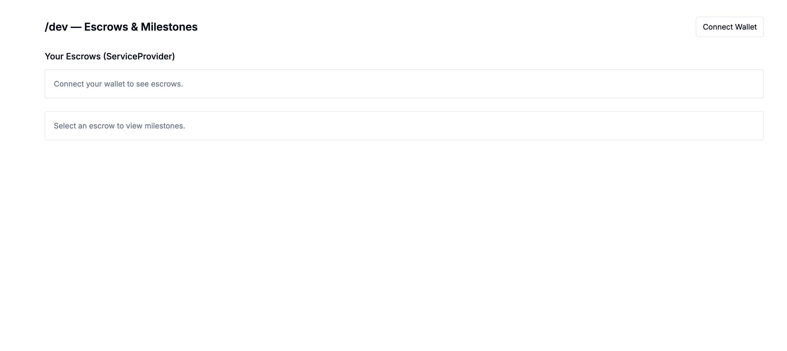
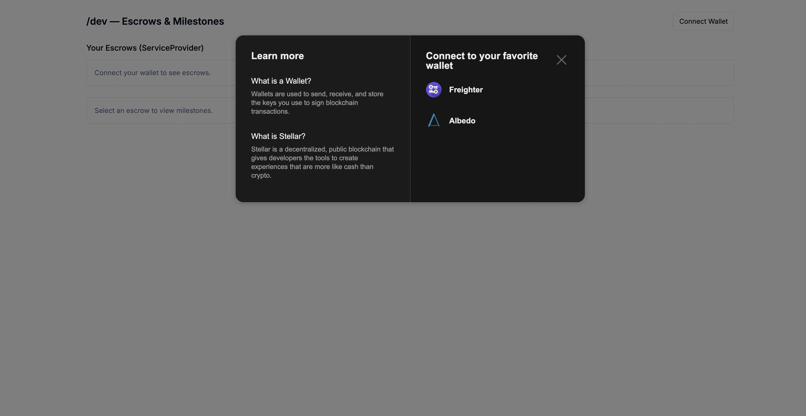
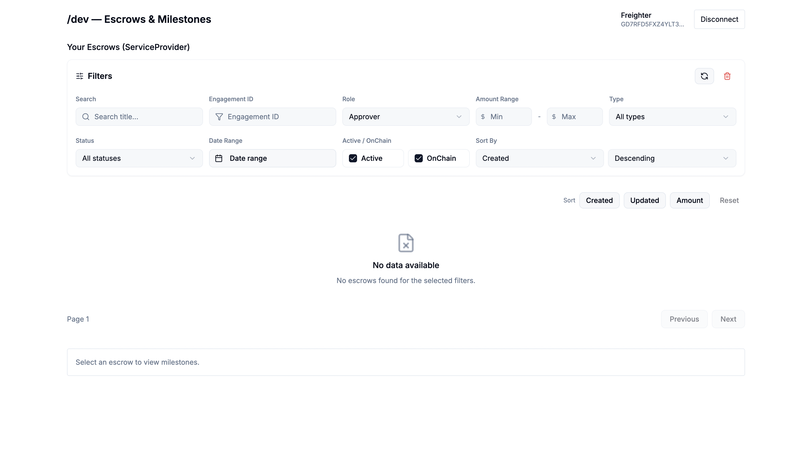

This is a [Next.js](https://nextjs.org) project bootstrapped with [`create-next-app`](https://nextjs.org/docs/app/api-reference/cli/create-next-app).

## Getting Started

First, install dependencies and run the development server:

```bash
npm install
npm run dev
```

Open [http://localhost:3000](http://localhost:3000) — it automatically redirects to `/dev` (the main view for this MVP).

---

## Trustless Work Escrow Blocks — Project Notes

### Providers (order is critical)
We wrap the App Router layout with the Blocks providers in this exact order (per docs):

```
ReactQueryClientProvider > TrustlessWorkProvider > WalletProvider > EscrowProvider > EscrowDialogsProvider > EscrowAmountProvider
```

Code: `src/app/layout.tsx`

### Pages and Components
- `src/app/page.tsx` — Redirects to `/dev` (App Router `redirect('/dev')`).
- `src/app/dev/page.tsx` — Developer portal main view with:
  - `EscrowListByRole` (lists escrows for the connected wallet; role enforced to Service Provider)
  - `MilestoneDetails` (milestones, with `ChangeMilestoneStatusDialog` and `ApproveMilestoneDialog`)

### Wallet
Uses the Blocks wallet kit modal. Click the header `WalletButton` → kit modal opens → pick Freighter (recommended on Testnet). We persist the selected wallet id and address.

### Fetching escrows by role
We rely on Blocks’ listings and hooks to fetch escrows for the connected address. The `EscrowsByRoleCards` component reads role/address from providers and query state — no custom fetchers are added.

### Testnet configuration
`TrustlessWorkProvider` points to the dev/test environment and reads an API key from `NEXT_PUBLIC_API_KEY`.
- File: `src/trustless-work-provider.tsx`

Create `./.env.local` at the repo root:

```
NEXT_PUBLIC_API_KEY=your_api_key_here
```

Then restart the dev server. Without this key, Indexer requests (e.g., get-escrows-by-role) return 401.

### Read vs. Write
- Read-only: listings, details, statuses.
- Write: initialize escrow, fund, change milestone status, approve, release. Requires valid API key and correct wallet role; Blocks auto-enables/disables action buttons based on role/state.

### What was used (Blocks)
- Wallet kit: `src/components/tw-blocks/wallet-kit/*`
- Providers: `src/components/tw-blocks/providers/*`
- Listings: `src/components/tw-blocks/escrows/escrows-by-role/cards/*`
- Milestones & actions: `src/components/tw-blocks/escrows/single-multi-release/*`

### Build
Ensure typecheck passes and build succeeds:

```
npm run build
```

### How escrows are fetched by role
We use the Blocks role-based hook under the hood (`useEscrowsByRoleQuery`) and the `EscrowsByRoleCards` UI. On `/dev`, the URL is forced to `role=serviceProvider` and the shared hook syncs filters with the URL.

### Read vs Write
- Read-only: listings, details, statuses.
- Write: initialize escrow, fund, change milestone status, approve, release. Requires a valid API key and proper wallet role; Blocks auto-gates buttons.

### Gotchas / Notes
- Provider order must not change. If hooks or dialogs fail, verify ordering in `src/app/layout.tsx`.
- Wallet kit modal uses web components; in dev/HMR you may see benign warnings about CustomElementRegistry or multiple Lit versions. A hard refresh clears stuck state.
- Ensure a USDC trustline in Freighter on Testnet for smoother asset interactions.
- If actions are disabled, confirm escrow state, funding, approvals, and your connected role.

### What I learned / gotchas
- Always align hooks and provider import paths (e.g., `@/components/tw-blocks/providers/*`) to avoid context mismatch errors.
- Normalize wallet ids (`freighter`, not `Freighter`) when preselecting with the wallet kit.
- Keep wallet-kit and mutations strictly client-only to avoid SSR window access.

---

## Screenshots






## Learn More

To learn more about Next.js, take a look at the following resources:

- [Next.js Documentation](https://nextjs.org/docs) - learn about Next.js features and API.
- [Learn Next.js](https://nextjs.org/learn) - an interactive Next.js tutorial.

You can check out [the Next.js GitHub repository](https://github.com/vercel/next.js) - your feedback and contributions are welcome!

## Deploy on Vercel

The easiest way to deploy your Next.js app is to use the [Vercel Platform](https://vercel.com/new?utm_medium=default-template&filter=next.js&utm_source=create-next-app&utm_campaign=create-next-app-readme) from the creators of Next.js.

Check out our [Next.js deployment documentation](https://nextjs.org/docs/app/building-your-application/deploying) for more details.
